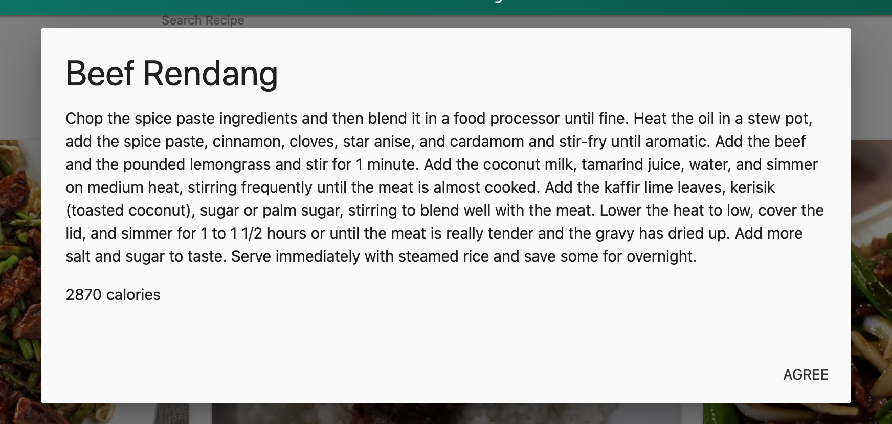

## Git-A-Recipe

## Description

A recipe web application targeted towards finding recipes targeted by key search words. The application takes user input data and searches one api to find photo, and recipe then invoking a second api that searches calorie counts for those specific dishes. 

Our application uses Materialize to create a crisp, user-friendly website. When a user clicks on a recipe a modal will pop up to to display all information on the recipe. If no recipe is found the user will be prompted to enter a different ingredient to search. 

## Usage

User will type a food ingredient in the input section. Once the search button is pressed the website will populate the page with all related recipes associated with that search word. The user can then click on a recipe to deploy a modal with all related recipe information. 

## Credits

##### Adam Ramono
##### Kevin Hernandez
##### James K 
##### Adam West 
##### Judge McGriff

## License